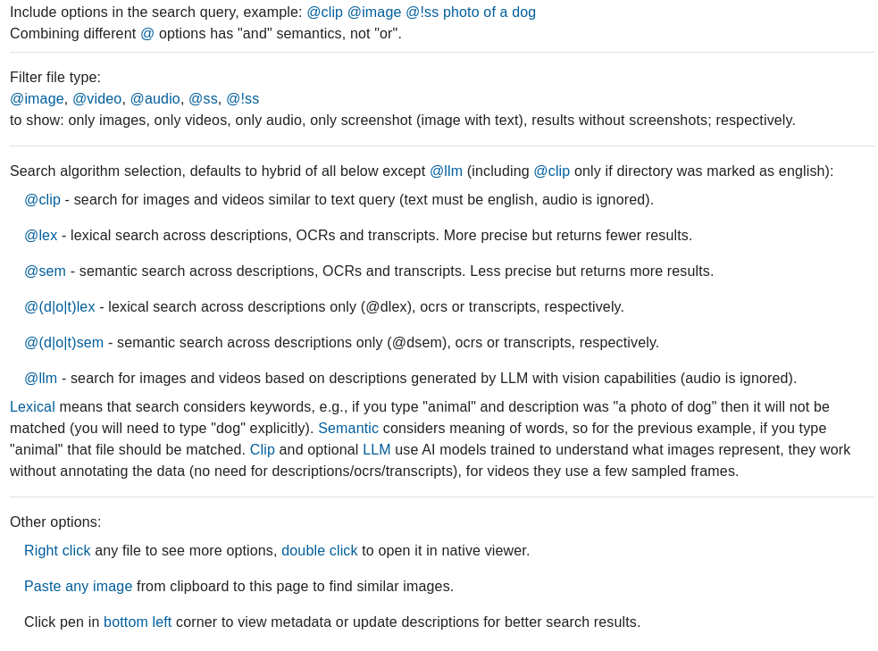

# kfe

Cross-platform File Explorer with Search Engine for Multimedia.

# Features
- Full privacy. Data never leaves your machine.
- Text query-based search that accounts for:
    - visual aspects of images and videos based on [CLIP](https://huggingface.co/docs/transformers/en/model_doc/clip) embeddings,
    - transcriptions that are automatically generated for audio and video files,
    - text that is automatically extracted from images,
    - descriptions that you can manually write using GUI.
- Similarity search capabilities:
    - find images or videos similar to one of images from your directory,
    - find images similar to any image pasted from clipboard,
    - find files with semantically similar metadata (descriptions, transcriptions or text extracted from image).
- Browser GUI that lets you easily use all of those search options, browse files and edit file metadata.
- Standalone program that depends only on ffmpeg. Project includes all the necessary database and search features.
- Works offline, can work with and without GPU.
- Works on Mac, Linux and Windows.
- Supports English and Polish languages.

## Intended use cases

Application was designed for directories having up to few tens of thousands of images, short (<10 minutes) videos or audio files. File names are assumed to be non-descriptive. Examples of such directories are:
- phone gallery or audio recordings copied to PC,
- data dumps from messaging apps like Messenger (Messenger app allows you to search only for text messages, but it allows downloading all media, which can be searched using this app),
- saved memes.

# Demo

TODO

# Installation

1. Make sure that you have `python>=3.10` and `ffmpeg` with `ffprobe` installed:
- For ffmpeg installation see: https://ffmpeg.org/download.html.
- To verify installation run command line and type `ffmpeg -version` and `ffprobe -version`, both should print some results.

2. Optional: create virtual environment:
 - Mac/Linux:
```sh
python -m venv env
source ./env/bin/activate
```
- Windows:
```sh
python -m venv env
env\Scripts\activate
```

3. Install the project:

```sh
pip install kfe
```

# Running

1. In console run:
```sh
kfe
```

If you get an error that the default `8000` port is taken you can change it using `kfe --port <other port>`. For more options run `kfe --help`.

2. Open `http://localhost:8000` in the browser.

3. Follow instructions on GUI, analyzing directory can take some time, but later searches will be fast. All analysis information will be stored on your disk and won't need to be done again. Adding first directory might be especially slow since all AI models will be downloaded. After they are downloaded application will work offline.

If you see CUDA out of memory errors you can still run the application using CPU with `kfe --cpu`. The transcription model is the most resource demanding, see the next section for instruction how to change it.

If you are on Linux and want to run application on system startup run `./systemd/install_with_systemd.sh`.

# Models

Application uses the following models/libraries:
- CLIP embeddings - for each image and video (from which multiple image frames are extracted) application generates CLIP embeddings using [openai/clip model](https://huggingface.co/openai/clip-vit-base-patch32). This enables searching images by arbitrary text, without need for any annotations.
- Transcriptions - for each audio and video files transcription is generated using [openai/whisper-large-v3](https://huggingface.co/openai/whisper-large-v3) model if you have CUDA or Apple silicon, otherwise [openai/whisper-base](https://huggingface.co/openai/whisper-base). This model requires more hardware resources than other models, you might want to change it, see the next section.
- OCR - for each image application attempts to extract text using [easyocr](https://github.com/JaidedAI/EasyOCR) library.
- Text embeddings - application generates embeddings of each type of text that can be searched (descriptions that you can write manually, transcriptions and OCR results) using [sentence-transformers/all-mpnet-base-v2](https://huggingface.co/sentence-transformers/all-mpnet-base-v2) model.
- Text lemmatization - each type of text and every user query is preprocessed using [spacy/en_core_web_trf](https://spacy.io/models/en#en_core_web_lg) lemmatization model for lexical search purposes. If you are unfamilar what this means, the tldr is that different forms of the same word (like `work = working = worked`) will be treated the same during this type of search.

## Changing models and finetuning

Application uses models from huggingface, for various reasons you might want to change them. Transcription model is the most resource demanding and can be changed with: `kfe --transcription-model <huggingface model id>`, where model id could be, for example, `openai/whisper-small`. See `kfe --help` for more info.

Currently other models can be changed only by modifying the source code. In order to do that see [backend/kfe/dependencies.py](backend/kfe/dependencies.py) file and adjust it accordingly. 

You might also want to finetune some models. In [backend/kfe/finetuning](backend/kfe/finetuning) there are jupyter notebooks that can help you with that. Currently there are only notebooks for transcription model, as initially I tried a smaller wav2vec model: [jonatasgrosman/wav2vec2-large-xlsr-53-english](https://huggingface.co/jonatasgrosman/wav2vec2-large-xlsr-53-english). Finetuning is especially beneficial if words in your files are spoken by a small number of different people. The recommended approach is to analyze the directory and generate initial bad transcriptions, fix some of them manually using GUI (even ~10 examples per speaker can significantly improve results), finetune the model on them and rerun transcription generation (`kfe --retranscribe-auto-transcribed`) to obtain higher quality.

You might also want to use paid models or models hosted in the cloud, like OpenAI whisper through the API. There is no support (and no plans) for that, you would need to reimplement transcriber interface in [backend/kfe/features/transcriber.py](backend/kfe/features/transcriber.py) to achieve it.


# How does the application work?

Application allows you to search individual directories. You can use many directories but there is no information shared between them and you can't search all of them at once. When you register a directory using GUI the following things happen.

### Initialization

1. Application creates a sqlite database file in the directory, named `.kfe.db`. This database stores almost all the metadata about files in the selected directory, including descriptions, extracted transcriptions, lemmatization results and more. You can see the SQL table format in [backend/kfe/persistence/model.py](backend/kfe/persistence/model.py). 
2. Applications scans the directory and adds every multimedia file to the database, subdirectories and other types of files are ignored.
3. For each file, application extracts relevant text (OCR for images, transcriptions for videos and audio) and lemmatizes it. Results are written to the database so it can be done only once.
4. Application generates various types of embeddings and stores them in `.embeddings` directory, there is a file with encoded embeddings for each original file in the directory. See `models` above to have an idea what embeddings are generated.
5. Application loads the data to various search structures:
    - lemmatized text is split into words and added to a reverse index structure, which is essentialy a map of `word -> list of files in which the word appears`,
    - embeddings are loaded into numpy matrices (different matrices for different types of embeddings).
6. Application generates thumbnails and saves them in `.thumbnails` subdirectory of the selected folder.
7. Application begins to watch for directory changes, processing new files the same way as above and cleaning up after the removed ones. Note that the GUI does NOT allow you to modify any files (and also doesn't do it by itself), you have to use your native file explorer for that.

If you restart the application and directory was already initialized before then only steps 5-7 happen.

### Query-time

At this stage directory is marked as ready for querying. When you enter a query without any `@` modifiers the following things happen.

1. Lexical/keyword search:
    - query is lemmatized and split into words,
    - reverse index is queried to load files which have descriptions, OCRs or transcrpitions that contain some of the words from the query,
    - files are scored according to [BM25 metric](https://en.wikipedia.org/wiki/Okapi_BM25).
2. Semantic search:
    - application generates query embedding using text embedding model,
    - matrices with pre-computed embeddings of descriptions, OCRs and transcriptions are used to compute cosine similarity of the query embedding and all of those embeddings.
3. CLIP search:
    - application generates query embedding using text CLIP encoder,
    - matrices with pre-computed clip embeddings of images and videos are used to compute cosine similarity of the query embedding and all of those embeddings.
4. Ordering results using hybrid approach. A variation of [reciprocal rank fusion](https://plg.uwaterloo.ca/~gvcormac/cormacksigir09-rrf.pdf) is used to combine results for all of those search modes. The variation is a custom problem-specific metric that attempts to weight confidence of individual retrievers and not just the ranks. See [backend/kfe/utils/search.py](backend/kfe/utils/search.py) for more details.
5. Ordered results with file thumbnails are returned to the UI which presents them to the user.


All of those structures and algorithms are written from scratch and included in the project. The application doesn't use tools such as elastic search for lexical search or faiss for similarity search. The assumption is that directories are not massive, they can contain up to few tens of thousands of files, not hundreds of thousands of files. For such use case this approach should work seamlessly on consumer grade machines (~200ms of search latency for a PC with 12gen i5 for a directory with ~5000 files).

Application lets you also choose search mode (e.g., search only transcriptions) and filter results, GUI help in the top right corner enumerates all the options:




### Resource usage

Application loads models in a lazy manner (only when they are needed) and recycles them automatically. If you have the application running in background it doesn't consume any GPU memory. When models required for querying are loaded they use about 2GB of memory.

For initialization, a heavier transcription model will be loaded when there are some audio files. During directory initialization application can consume up to 5GB of GPU memory. The application works on CPU the same but might be slower, you can pass `--cpu` flag to force CPU usage.

Apart from that, application requires ~1GB of RAM when idle and >2GB when used (exact numbers depend on how many files you have, 2GB was for ~10k files). Add GPU stats to that if you are not using GPU.

Storage: All models and dependencies require <10GB of disk space.


### Removing all data created or downloaded by the application

Models are stored in `.kfe` directory in the home folder, OCR model is stored in `.EasyOCR` directory in home folder. Apart from that in each registered directory there are `.embeddings` and `.thumbnails` folders and `.kfe.db` file.

To backup generated or manually written metadata it suffices to copy `.kfe.db` file.

